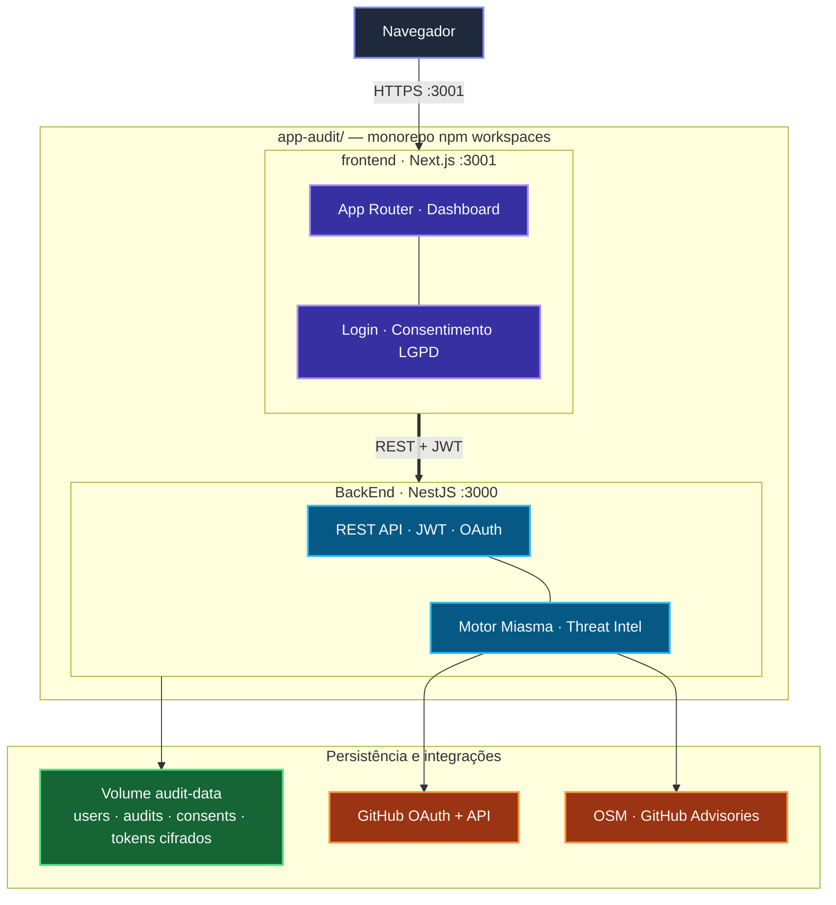

# App Audit

Plataforma de auditoria de segurança para repositórios GitHub — detecção de malware (Miasma), supply chain, secrets, CI/CD e dependências comprometidas.

**Autor:** Francisco Stanley Rodrigues Albuquerque

## Arquitetura



Diagrama detalhado (camadas Clean Architecture): [docs/architecture.md](./docs/architecture.md)

## Início rápido (Docker)

```bash
cp .env.docker.example .env
# Preencha JWT_SECRET, ADMIN_PASSWORD, GITHUB_TOKEN e OAuth (opcional)
docker compose up -d --build
```

| Serviço | URL |
|---------|-----|
| Frontend | http://localhost:3001 |
| API | http://localhost:3000 |
| Health | http://localhost:3000/health |

Após alterações no código:

```bash
docker compose stop
docker compose up -d --build
```

Atalhos npm: `npm run docker:up` · `npm run docker:stop` · `npm run docker:restart`

Detalhes: [docs/deployment.md](./docs/deployment.md)

## Desenvolvimento local (sem Docker)

```bash
npm install
cd BackEnd && npm run setup && cd ..
# Configure ADMIN_EMAIL e ADMIN_PASSWORD no BackEnd/.env
npm run dev
```

| Serviço | URL |
|---------|-----|
| API | http://localhost:3000 |
| Swagger | http://localhost:3000/api/docs (dev) |
| Frontend | http://localhost:3001 |

## Telas

Screenshots das interfaces em [docs/screenshots.md](./docs/screenshots.md).

## Usuários

Não há credenciais fixas. O primeiro administrador é criado via:

1. `ADMIN_EMAIL` + `ADMIN_PASSWORD` no `.env` (primeiro boot), ou
2. `npm run users:create` (CLI), ou
3. `POST /auth/users` (admin autenticado)

## Documentação

| Doc | Descrição |
|-----|-----------|
| [docs/README.md](./docs/README.md) | Índice |
| [docs/screenshots.md](./docs/screenshots.md) | Telas da aplicação |
| [docs/architecture.md](./docs/architecture.md) | Arquitetura (Mermaid) |
| [docs/technical.md](./docs/technical.md) | Referência técnica |
| [docs/deployment.md](./docs/deployment.md) | Deploy produção |
| [docs/api.md](./docs/api.md) | API HTTP |
| [docs/collections/](./docs/collections/) | Postman e Insomnia |

## Scripts

```bash
npm run dev              # backend + frontend
npm run build            # build completo
npm test                 # testes
npm run audit:miasma -w BackEnd
```
