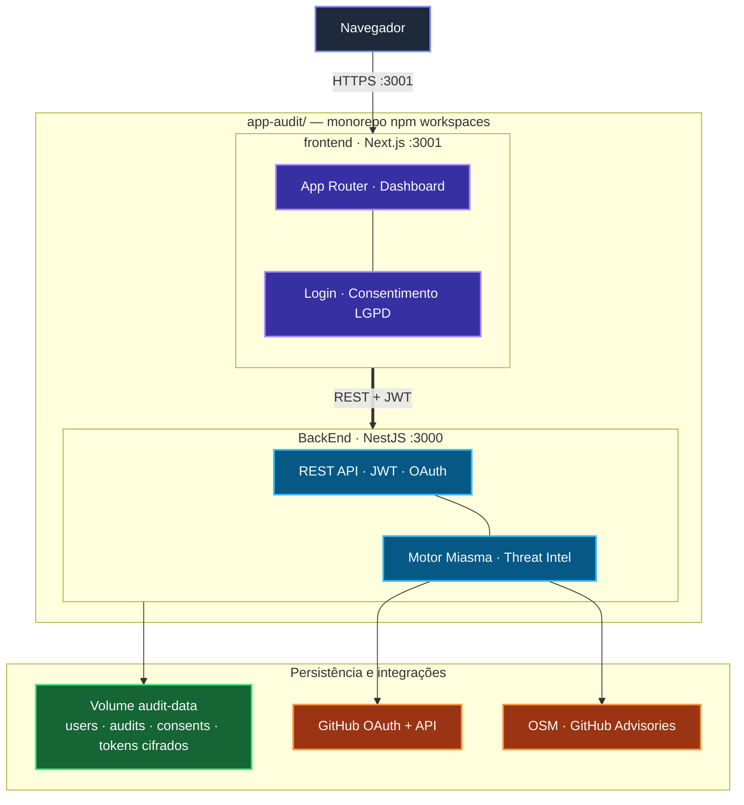
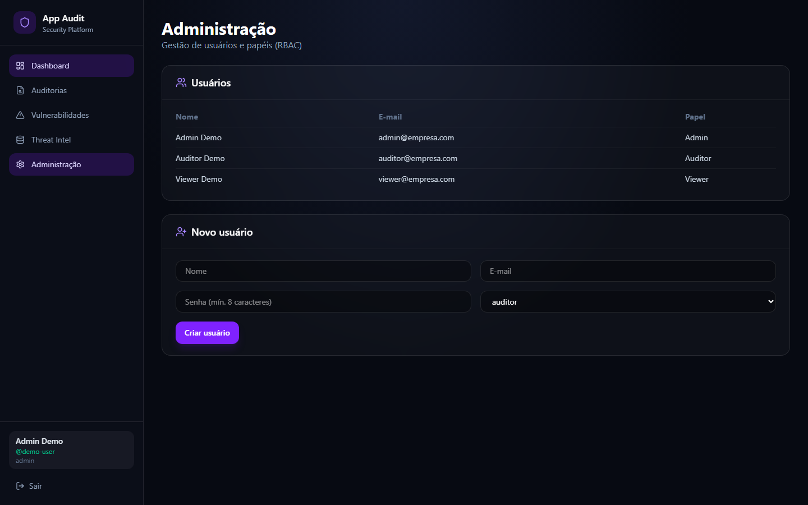

# App Audit

[](https://github.com/FranciscoStanley/app-audit/actions/workflows/ci.yml)
[](https://github.com/FranciscoStanley/app-audit/actions/workflows/security.yml)
[](./LICENSE)

Plataforma de auditoria de segurança para repositórios GitHub — detecção de malware (Miasma), supply chain, secrets, CI/CD, dependências comprometidas e **remediação automática** (Dependabot, lockfile, PR).

**Autor:** Francisco Stanley Rodrigues Albuquerque

| Documento | Descrição |
|-----------|-----------|
| [CONTRIBUTING](./CONTRIBUTING.md) | Como contribuir, PRs e padrões de código |
| [CODE_OF_CONDUCT](./CODE_OF_CONDUCT.md) | Código de conduta da comunidade |
| [CHANGELOG](./CHANGELOG.md) | Histórico de versões |
| [ROADMAP](./ROADMAP.md) | Evolução do produto |
| [Limitações](./docs/LIMITATIONS.md) | Limites arquiteturais (single-node, file storage) |
| [License (MIT)](./LICENSE) | Termos de uso e redistribuição |
| [Security](./SECURITY.md) | Reporte de vulnerabilidades e boas práticas |

## Arquitetura



Diagrama detalhado (camadas Clean Architecture): [docs/architecture.md](./docs/architecture.md)

## Início rápido (Docker)

```bash
cp .env.docker.example .env
# Preencha JWT_SECRET, ADMIN_PASSWORD, GITHUB_TOKEN e OAuth (opcional)
docker compose up -d --build
```

| Serviço | URL |
|---------|-----|
| Frontend | http://localhost:3001 |
| API | http://localhost:3000 |
| Health (liveness) | http://localhost:3000/health |
| Health (readiness) | http://localhost:3000/health/ready |
| API REST | http://localhost:3000/v1/… |

Após alterações no código:

```bash
docker compose stop
docker compose up -d --build
```

Atalhos npm: `npm run docker:up` · `npm run docker:stop` · `npm run docker:restart`

Detalhes: [docs/deployment.md](./docs/deployment.md)

## Desenvolvimento local (sem Docker)

```bash
npm install
cd BackEnd && npm run setup && cd ..
# Configure ADMIN_EMAIL e ADMIN_PASSWORD no BackEnd/.env
npm run dev
```

| Serviço | URL |
|---------|-----|
| API | http://localhost:3000 |
| Swagger | http://localhost:3000/api/docs (dev) |
| Frontend | http://localhost:3001 |

## Telas

Capturar de tela das interfaces (dados de demonstração). Galeria completa: [docs/screenshots.md](./docs/screenshots.md).

### Login

Autenticação por e-mail/senha (com aceite de Termos e Privacidade) e **Entrar com GitHub** (OAuth).


### Consentimento LGPD (GitHub OAuth)

Modal exibido antes do redirect ao GitHub: finalidades, permissões OAuth e direitos do titular.


### Dashboard

Card de conta GitHub conectada, métricas da última auditoria (repositórios, vulnerabilidades, pacotes monitorados, veredito) e atalhos para relatório.


### Auditorias

Histórico paginado, status da conexão GitHub (desconectar/revogar consentimento) e **Nova auditoria**. Varreduras, remediações e sync de Threat Intel **continuam em segundo plano** — você pode navegar entre telas enquanto o job executa; o banner no topo e a sidebar exibem progresso.


### Detalhe da auditoria

Relatório Markdown, download PDF/MD e vulnerabilidades paginadas por repositório.


## Remediação automática

- **Individual:** botão *Resolver* → *Aplicar correção* no card da vulnerabilidade (job assíncrono)
- **Em lote:** botão *Corrigir todas (N)* na página Vulnerabilidades (job assíncrono)
- **Segundo plano:** banner global + indicador na sidebar; polling automático (auditoria/remediação) ou estado persistido no Zustand (Threat Intel sync)
- **Dependabot:** alertas GitHub detectados na auditoria com tag `[Dependabot]`
- **PR automático:** quando `main` é branch protegida

### Vulnerabilidades

Todas as categorias detectadas (Secrets, Supply Chain, CI/CD, Dependabot) com filtros, paginação e remediação automática em lote.


### Remediação automática

Plano de remediação expandido, passos automatizados e botão *Aplicar correção* (job assíncrono).


### Threat Intelligence

Sincronização com GitHub Advisories e OpenSourceMalware (pacotes, repositórios baseline, fontes habilitadas). A UI mantém o estado de sync em segundo plano via `background-tasks-store`.


### Administração

Gestão de usuários e papéis RBAC — visível apenas para `admin`.



Para regenerar as capturas de tela: `npm run docs:screenshots` (frontend em `http://localhost:3001`).

## Usuários

Não há credenciais fixas. O primeiro administrador é criado via:

1. `ADMIN_EMAIL` + `ADMIN_PASSWORD` no `.env` (primeiro boot), ou
2. `npm run users:create` (CLI), ou
3. `POST /auth/users` (admin autenticado)

## Documentação

| Doc | Descrição |
|-----|-----------|
| [docs/README.md](./docs/README.md) | Índice |
| [docs/screenshots.md](./docs/screenshots.md) | Telas da aplicação |
| [docs/architecture.md](./docs/architecture.md) | Arquitetura (Mermaid) |
| [docs/technical.md](./docs/technical.md) | Referência técnica |
| [docs/deployment.md](./docs/deployment.md) | Deploy produção |
| [docs/api.md](./docs/api.md) | API HTTP |
| [docs/collections/](./docs/collections/) | Postman e Insomnia |
| [docs/operations.md](./docs/operations.md) | Backup, logs, releases |
| [docs/LIMITATIONS.md](./docs/LIMITATIONS.md) | Limites de escala v1 |
| [ROADMAP.md](./ROADMAP.md) | Próximas versões |
| [CHANGELOG.md](./CHANGELOG.md) | Notas de release |
| [CONTRIBUTING.md](./CONTRIBUTING.md) | Guia de contribuição |
| [CODE_OF_CONDUCT.md](./CODE_OF_CONDUCT.md) | Código de conduta |
| [SECURITY.md](./SECURITY.md) | Política de segurança |

## Licença

Este projeto está licenciado sob a [MIT License](./LICENSE).

## Scripts

```bash
npm run dev              # backend + frontend
npm run build            # build completo
npm test                 # testes
npm run audit:miasma -w BackEnd
```
