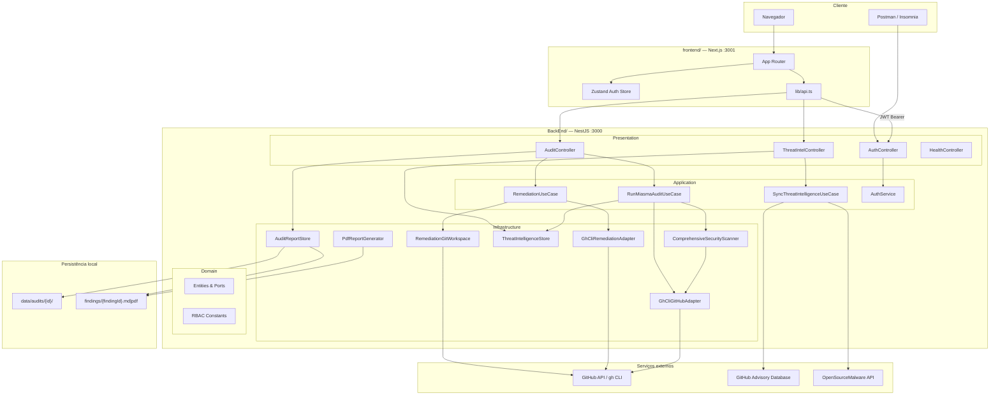
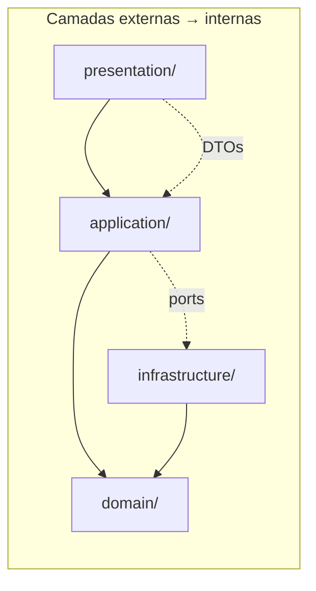
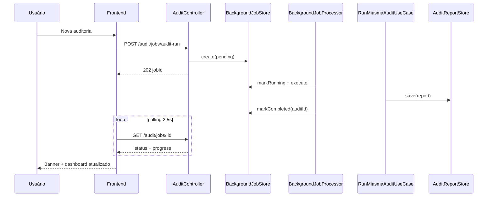
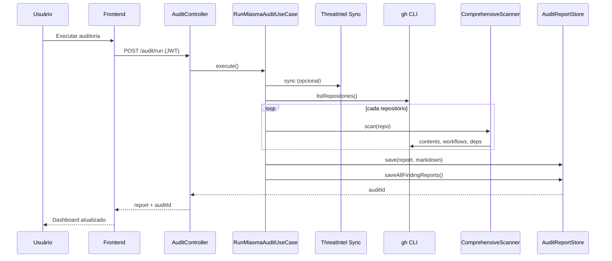
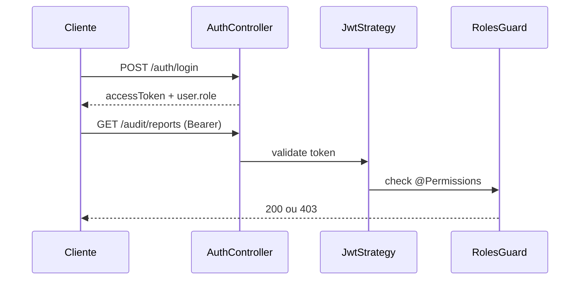
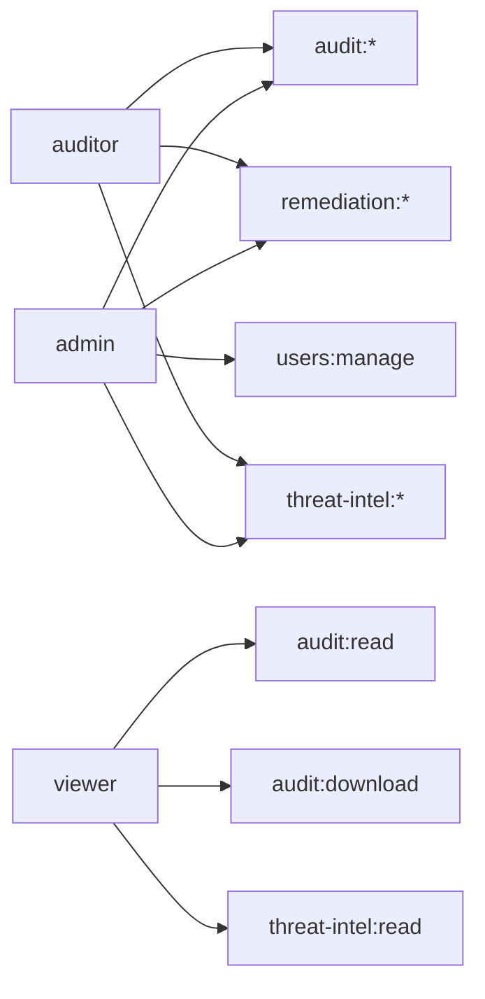
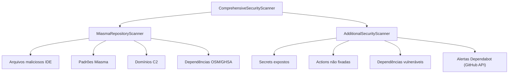
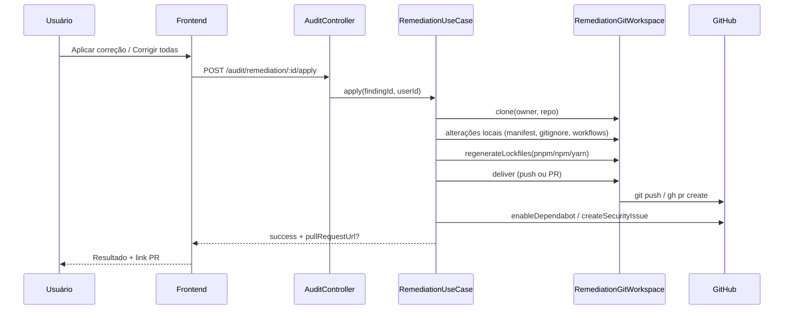

# Arquitetura — App Audit

**Autor:** Francisco Stanley Rodrigues Albuquerque

## Visão geral do sistema



## Clean Architecture (BackEnd)



| Camada | Responsabilidade | Exemplos |
|--------|------------------|----------|
| **domain** | Regras e contratos puros | `AuditReport`, `ThreatFinding`, `GITHUB_REPOSITORY_PORT` |
| **application** | Orquestração de casos de uso | `RunMiasmaAuditUseCase`, `RemediationUseCase` |
| **infrastructure** | Adapters e I/O | `GhCliGitHubAdapter`, scanners, storage |
| **presentation** | HTTP, Swagger, guards | Controllers, DTOs, decorators RBAC |

## Fluxo de auditoria (jobs assíncronos)



> Endpoints síncronos `POST /audit/run` permanecem para CLI. Ver também fluxo legado abaixo.

## Fluxo de auditoria (síncrono — legado)



## Fluxo de autenticação e RBAC



## Papéis e permissões



## Scanner de vulnerabilidades



## Fluxo de remediação automática



## Estrutura de persistência

```
BackEnd/data/audits/
└── {auditId}/
    ├── report.json      # relatório completo
    ├── report.md        # markdown consolidado
    ├── report.pdf       # PDF consolidado (sob demanda)
    └── findings/
        ├── {findingId}.md
        └── {findingId}.pdf

BackEnd/data/jobs/
└── {jobId}/
    └── job.json         # fila assíncrona (audit, remediação)
```
