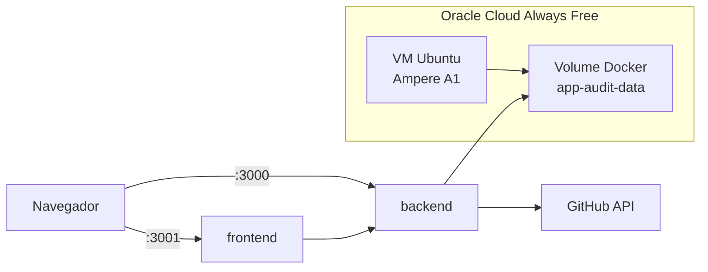

# Deploy no Oracle Cloud (Always Free)

**Autor:** Francisco Stanley Rodrigues Albuquerque  
**Versão do guia:** 1.0.0 · **App Audit:** 1.1.0

Este documento descreve o deploy **gratuito** do App Audit em uma VM **Oracle Cloud Infrastructure (OCI) Always Free**, usando Docker Compose.

## O que foi preparado no repositório

| Artefato | Função |
|----------|--------|
| `docker-compose.oracle.yml` | Compose de produção para a VM |
| `.env.oracle.example` | Modelo de variáveis com IP público |
| `infra/oracle-cloud/Caddyfile` | HTTPS opcional com domínio (profile `proxy`) |
| `scripts/oracle-cloud/01-bootstrap-vm.sh` | Instala Docker e firewall na VM |
| `scripts/oracle-cloud/02-deploy-app.sh` | Clona/atualiza código e sobe os containers |
| `scripts/oracle-cloud/03-health-check.sh` | Valida `/health` e frontend |

## Visão geral



## Pré-requisitos

- Conta [Oracle Cloud](https://www.oracle.com/cloud/free/) (Always Free)
- Par de chaves SSH (`ssh-keygen -t ed25519`)
- Token GitHub com escopos `repo` e `security_events`
- Repositório: [github.com/FranciscoStanley/app-audit](https://github.com/FranciscoStanley/app-audit)

### Secrets a gerar antes do deploy

```bash
# JWT (32+ caracteres)
openssl rand -base64 48

# Senha do admin (12+ caracteres)
# Defina manualmente — não commitar
```

---

## Fase 1 — Console OCI: rede e segurança

### 1.1 Criar compartment (opcional)

1. Menu **≡** → **Identity & Security** → **Compartments**
2. **Create Compartment** → nome: `app-audit`

### 1.2 VCN (rede virtual)

Se não existir VCN padrão:

1. **Networking** → **Virtual cloud networks** → **Start VCN Wizard**
2. Escolha **Create VCN with Internet Connectivity**
3. Nome: `app-audit-vcn` → **Create**

### 1.3 Security List — liberar portas

1. Na VCN → **Security Lists** → lista padrão da subnet pública
2. **Add Ingress Rules**:

| Source CIDR | Protocol | Dest. Port | Descrição |
|-------------|----------|------------|-----------|
| `0.0.0.0/0` | TCP | 22 | SSH |
| `0.0.0.0/0` | TCP | 3000 | API App Audit |
| `0.0.0.0/0` | TCP | 3001 | Frontend App Audit |
| `0.0.0.0/0` | TCP | 80 | HTTP (Caddy, opcional) |
| `0.0.0.0/0` | TCP | 443 | HTTPS (Caddy, opcional) |

> **Importante:** libere também no **iptables** da VM via `01-bootstrap-vm.sh` (ufw). As duas camadas (OCI + SO) precisam estar alinhadas.

---

## Fase 2 — Console OCI: criar a VM

1. **Compute** → **Instances** → **Create instance**
2. Nome: `app-audit-vm`
3. **Image:** Ubuntu 22.04 ou 24.04 (aarch64 — **Ampere A1**, Always Free)
4. **Shape:** `VM.Standard.A1.Flex` — 1 OCPU, 6 GB RAM (ou até 4 OCPU / 24 GB no limite free)
5. **Networking:** subnet pública, **Assign a public IPv4 address** = Sim
6. **SSH keys:** cole sua chave pública (`~/.ssh/id_ed25519.pub`)
7. **Boot volume:** 50–100 GB
8. **Create**

Anote o **IP público** da instância (ex.: `132.145.x.x`).

### Testar SSH

```bash
ssh -i ~/.ssh/id_ed25519 ubuntu@SEU_IP_PUBLICO
```

---

## Fase 3 — Bootstrap na VM

Na VM (via SSH):

```bash
# Clonar repositório
sudo mkdir -p /opt/app-audit
sudo chown $USER:$USER /opt/app-audit
git clone https://github.com/FranciscoStanley/app-audit.git /opt/app-audit
cd /opt/app-audit

# Bootstrap: Docker + ufw
chmod +x scripts/oracle-cloud/*.sh
bash scripts/oracle-cloud/01-bootstrap-vm.sh

# Ativar grupo docker (ou reconecte SSH)
newgrp docker
```

---

## Fase 4 — Configurar `.env`

```bash
cd /opt/app-audit
cp .env.oracle.example .env
nano .env
```

Substitua **todas** as ocorrências de `PUBLIC_IP` pelo IP real da VM.

Exemplo com IP `132.145.10.20`:

```env
CORS_ORIGIN=http://132.145.10.20:3001
NEXT_PUBLIC_API_URL=http://132.145.10.20:3000
GITHUB_OAUTH_CALLBACK_URL=http://132.145.10.20:3000/v1/auth/github/callback
FRONTEND_URL=http://132.145.10.20:3001

JWT_SECRET=<sua-chave-48-bytes-base64>
ADMIN_PASSWORD=<senha-forte-12+>
GITHUB_TOKEN=ghp_xxxxxxxx
SWAGGER_ENABLED=false
```

| Variável | Obrigatória | Notas |
|----------|-------------|-------|
| `JWT_SECRET` | Sim | 32+ caracteres |
| `ADMIN_PASSWORD` | Sim | 12+ caracteres |
| `GITHUB_TOKEN` | Sim | Scans e remediação |
| `NEXT_PUBLIC_API_URL` | Sim | URL que o **navegador** usa para a API |
| `CORS_ORIGIN` | Sim | URL exata do frontend |

---

## Fase 5 — Deploy

### Opção A — Build na VM (recomendado na primeira vez)

```bash
cd /opt/app-audit
bash scripts/oracle-cloud/02-deploy-app.sh
```

O script faz `git pull` e `docker compose -f docker-compose.oracle.yml up -d --build`.

### Opção B — Imagens do GHCR

Após publicar uma release (`git tag v1.1.0 && git push origin v1.1.0`):

```bash
cd /opt/app-audit
USE_GHCR=true APP_VERSION=v1.1.0 bash scripts/oracle-cloud/02-deploy-app.sh
```

---

## Fase 6 — Verificação

Na VM:

```bash
bash scripts/oracle-cloud/03-health-check.sh
```

No seu computador:

| URL | Esperado |
|-----|----------|
| `http://SEU_IP:3000/health` | `{"status":"ok",...}` |
| `http://SEU_IP:3001` | Tela de login do App Audit |

Primeiro acesso: use `ADMIN_EMAIL` e `ADMIN_PASSWORD` do `.env`.

### Logs e manutenção

```bash
cd /opt/app-audit
docker compose -f docker-compose.oracle.yml logs -f
docker compose -f docker-compose.oracle.yml ps
docker compose -f docker-compose.oracle.yml restart
```

Dados persistentes: volume Docker `app-audit-data` → `BackEnd/data/` dentro do container.

---

## Fase 7 — GitHub OAuth (opcional)

1. GitHub → **Settings** → **Developer settings** → **OAuth Apps** → **New OAuth App**
2. Homepage: `http://SEU_IP:3001`
3. Callback: `http://SEU_IP:3000/v1/auth/github/callback`
4. Copie Client ID e Secret para `.env`
5. Reinicie: `docker compose -f docker-compose.oracle.yml up -d`

Ou use na raiz do projeto local: `npm run setup:oauth`

---

## HTTPS com domínio (opcional)

Se tiver domínio apontando para o IP da VM:

1. DNS: `audit.seudominio.com` e `api.seudominio.com` → IP da VM
2. Ajuste `.env`:

```env
DOMAIN=audit.seudominio.com
API_DOMAIN=api.seudominio.com
CORS_ORIGIN=https://audit.seudominio.com
NEXT_PUBLIC_API_URL=https://api.seudominio.com
FRONTEND_URL=https://audit.seudominio.com
GITHUB_OAUTH_CALLBACK_URL=https://api.seudominio.com/v1/auth/github/callback
```

3. Rebuild do frontend (URL baked no build) e suba com Caddy:

```bash
docker compose -f docker-compose.oracle.yml --profile proxy up -d --build
```

O Caddy obtém certificado Let's Encrypt automaticamente.

---

## Troubleshooting

| Sintoma | Causa provável | Solução |
|---------|----------------|---------|
| Timeout no browser | Porta fechada na Security List OCI | Revisar Fase 1.3 |
| `Connection refused` | ufw ou containers parados | `sudo ufw status`, `docker compose ps` |
| Frontend sem API | `NEXT_PUBLIC_API_URL` errado | Corrigir `.env` e **rebuild** frontend |
| CORS error | `CORS_ORIGIN` ≠ URL do frontend | Igualar URL exata (com porta) |
| `JWT_SECRET` inválido | Menos de 32 chars | `openssl rand -base64 48` |
| Build lento na VM | ARM + primeira build | Normal; use GHCR depois |

---

## Custos

- **VM Ampere A1** dentro dos limites Always Free: **US$ 0**
- Tráfego de saída: primeira 10 TB/mês free na região home
- Sem domínio: use IP + portas 3000/3001

---

## Checklist pós-deploy

- [ ] `/health` responde 200
- [ ] Login com admin funciona
- [ ] `SWAGGER_ENABLED=false` em produção
- [ ] `.env` não está no Git
- [ ] Volume `app-audit-data` existe (`docker volume ls`)
- [ ] Backup periódico do volume (snapshots OCI ou `docker run` backup)

---

## Referências

- [Deploy geral](./deployment.md)
- [Limitações v1](./LIMITATIONS.md)
- [Oracle Cloud Free Tier](https://www.oracle.com/cloud/free/)
- [GHCR — workflow release](../.github/workflows/release.yml)
