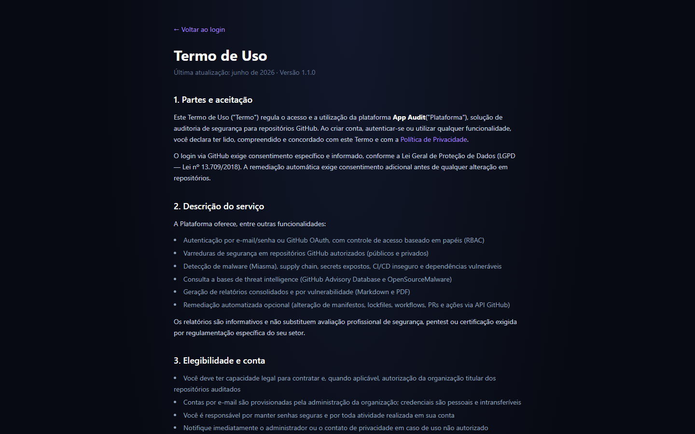
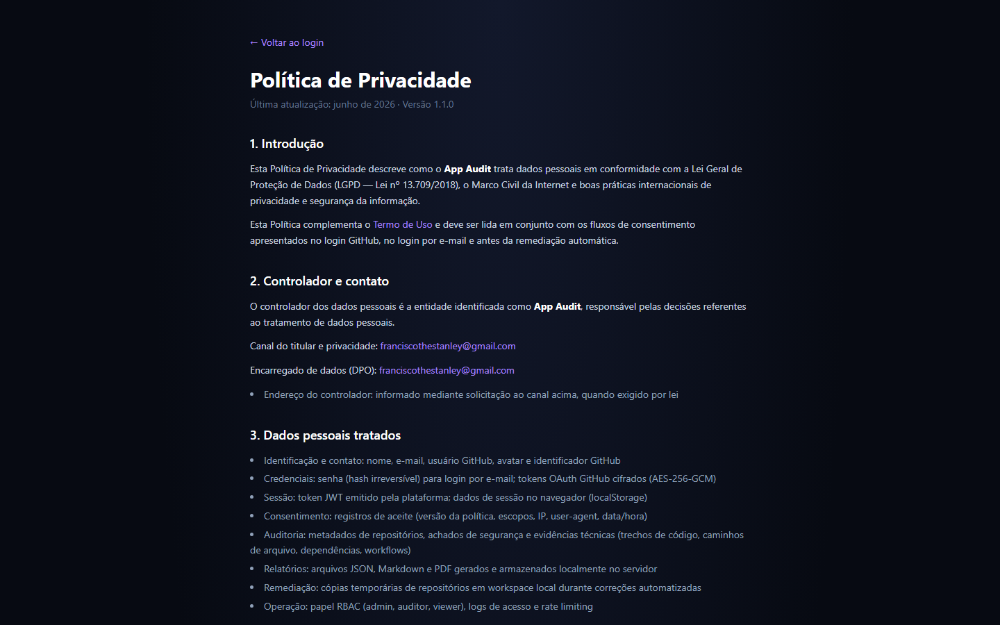
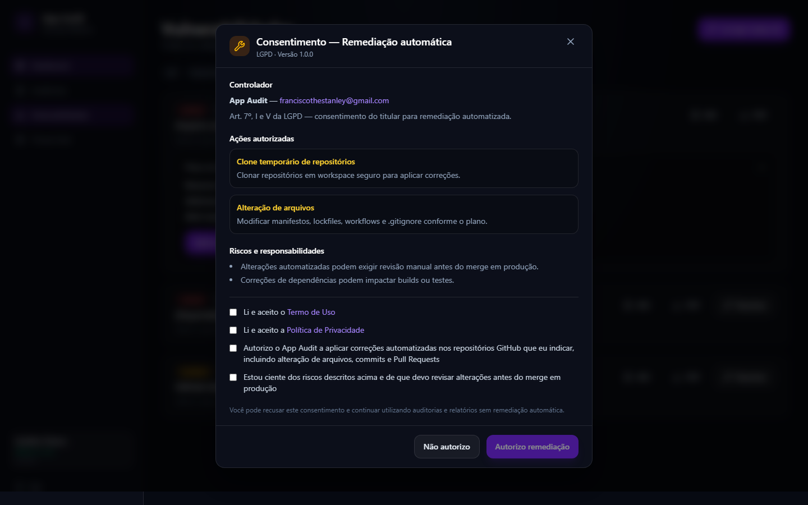

# Telas da aplicação

**Autor:** Francisco Stanley Rodrigues Albuquerque

Interface do App Audit — plataforma de auditoria de segurança para repositórios GitHub.

> As capturas abaixo usam dados de demonstração para ilustrar o fluxo da aplicação.

## Login

Tela de autenticação com **Entrar com GitHub** (OAuth), links para Termos e Privacidade, e login por e-mail/senha com **checkboxes obrigatórios** de Termo de Uso e Política de Privacidade (LGPD).


## Consentimento LGPD (GitHub OAuth)

Modal de consentimento informado exibido antes do redirect ao GitHub: finalidades, permissões OAuth, direitos do titular e checkboxes obrigatórios.


## Termo de Uso

Página legal pública (`/legal/termos`) com seções sobre serviço, GitHub OAuth, remediação automática, uso aceitável e contato.



## Política de Privacidade

Página legal pública (`/legal/privacidade`) com bases legais LGPD, dados tratados, retenção e direitos do titular.



## Dashboard

Visão geral com card de **conta GitHub conectada** (OAuth ativo), métricas da última auditoria (repositórios, vulnerabilidades, pacotes monitorados, veredito) e atalhos para relatório e vulnerabilidades. Quando há tarefas em execução (varredura, remediação ou sync de Threat Intel), um **banner amarelo** no topo indica progresso; a sidebar exibe contador de jobs em execução.


## Auditorias

Histórico paginado de varreduras, status da conexão GitHub (com opção de desconectar/revogar consentimento) e botão **Nova auditoria**. A varredura roda como **job assíncrono** — é possível navegar para outras telas enquanto o banner exibe o andamento.


## Detalhe da auditoria

Relatório consolidado em Markdown (com download PDF/MD), veredito e lista paginada de vulnerabilidades por repositório.


## Vulnerabilidades

Todas as categorias detectadas na última auditoria (Secrets, Supply Chain, CI/CD, Dependabot) com filtros por categoria, paginação e botão **Corrigir todas (N)** para remediação em lote.


## Remediação automática

Plano de remediação expandido no card da vulnerabilidade, passos automatizados e botão **Aplicar correção** (job assíncrono).


## Consentimento de remediação

Modal exibido na **primeira** tentativa de remediação (individual ou em lote): ações autorizadas, riscos e checkboxes de aceite (Termos, Privacidade, remediação e ciência de riscos).



## Threat Intelligence

Status da sincronização com GitHub Advisories e OpenSourceMalware: última sync, pacotes monitorados, repositórios baseline e indicadores de fontes habilitadas. O botão **Sincronizar** usa o store global de tarefas — o estado persiste ao navegar entre menus (banner + sidebar).


## Administração

Visível apenas para usuários com papel **admin**. Listagem paginada de usuários com botão **Editar** (nome, papel RBAC e senha opcional) e formulário para criar novos usuários.


## Atualizar capturas

Com Docker ou frontend rodando em `http://localhost:3001`:

```bash
docker compose up -d
npm run docs:screenshots
```

Alternativa (build local de produção):

```bash
npm run build -w frontend
npx next start -p 3002 -w frontend
SCREENSHOT_BASE_URL=http://localhost:3002 npm run docs:screenshots
```

Os arquivos PNG são gravados em `docs/screenshots/`.
