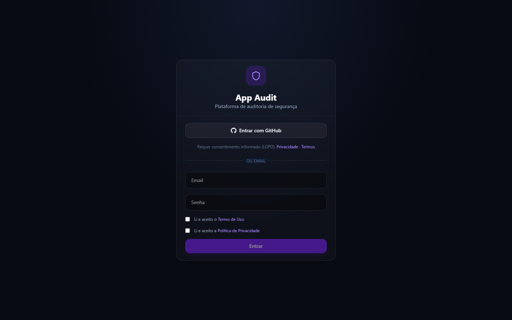
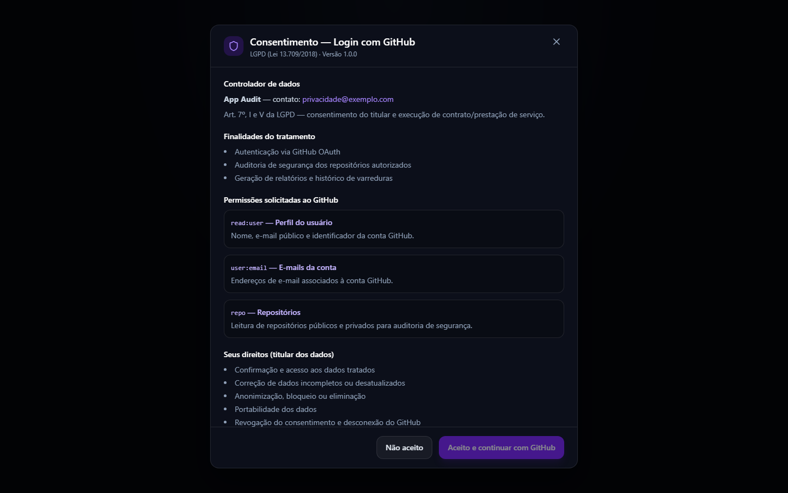
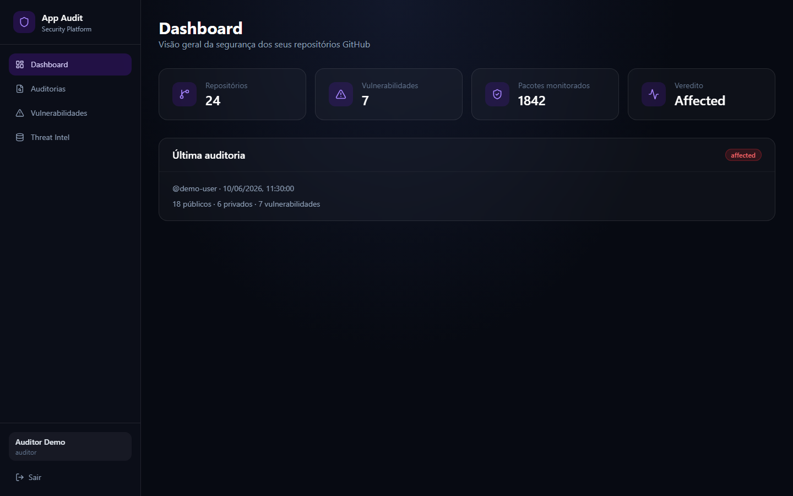
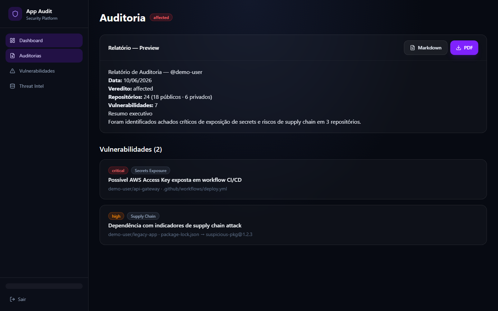
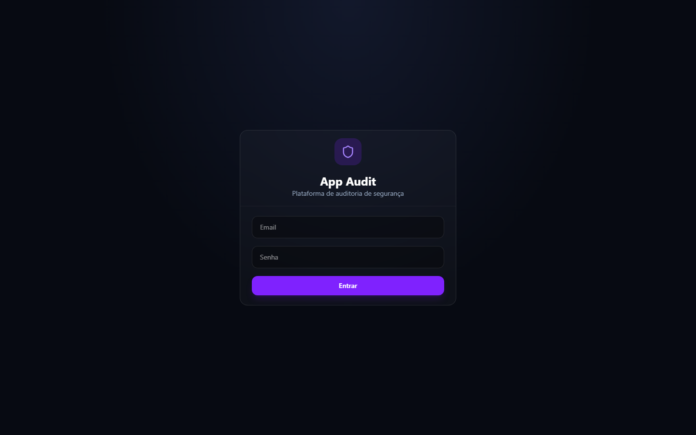
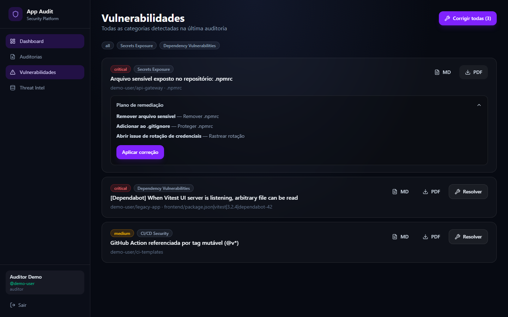
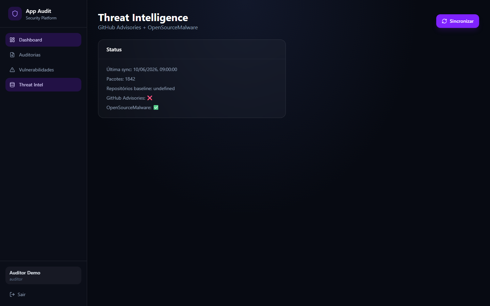

# Telas da aplicação

**Autor:** Francisco Stanley Rodrigues Albuquerque

Interface do App Audit — plataforma de auditoria de segurança para repositórios GitHub.

> As capturas abaixo usam dados de demonstração para ilustrar o fluxo da aplicação.

## Login

Tela de autenticação com login por email/senha e opção **Entrar com GitHub** (OAuth).



## Consentimento LGPD (GitHub OAuth)

Modal de consentimento informado exibido antes do redirect ao GitHub: finalidades, permissões OAuth, direitos do titular e checkboxes obrigatórios.



## Dashboard

Visão geral com métricas da última auditoria: repositórios, vulnerabilidades, pacotes monitorados e veredito. Quando há jobs em execução, um **banner amarelo** no topo indica progresso (varredura ou remediação).



## Auditorias

Histórico de varreduras, status da conexão GitHub e botão para executar nova auditoria. A varredura roda como **job assíncrono** — é possível navegar para outras telas enquanto o banner exibe o andamento.


## Detalhe da auditoria

Relatório consolidado em Markdown, download PDF e lista de vulnerabilidades por repositório.



## Vulnerabilidades

Todas as categorias detectadas (Secrets, Supply Chain, CI/CD, Dependabot) com filtros por categoria e botão **Corrigir todas**.



## Remediação automática

Plano de remediação, aplicação automática via Git workspace (manifesto + lockfile) e Pull Request quando o branch padrão é protegido.



## Threat Intelligence

Status da sincronização com GitHub Advisories e OpenSourceMalware.



## Atualizar capturas

Com Docker ou frontend rodando em `http://localhost:3001`:

```bash
docker compose up -d
npm run docs:screenshots
```

Alternativa (build local de produção):

```bash
npm run build -w frontend
npx next start -p 3002 -w frontend
SCREENSHOT_BASE_URL=http://localhost:3002 npm run docs:screenshots
```

Os arquivos PNG são gravados em `docs/screenshots/`.
