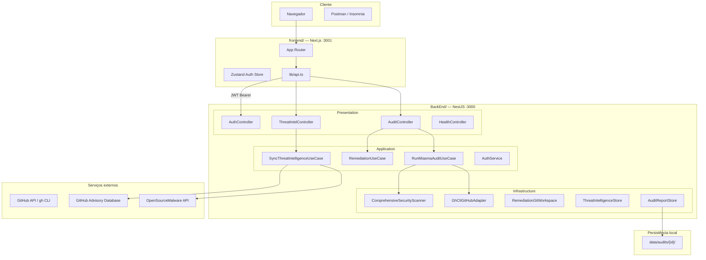
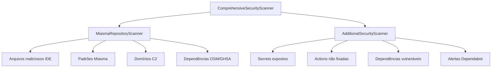

# Arquitetura

Visão arquitetural completa do App Audit — monorepo, camadas e integrações.

---

## Visão geral do sistema



---

## Monorepo npm workspaces

```
app-audit/
├── BackEnd/     # NestJS API — rotas /v1
├── frontend/    # Next.js App Router
├── docs/        # documentação
├── scripts/     # utilitários
└── infra/       # Oracle Cloud, etc.
```

| Workspace | Porta | Responsabilidade |
|-----------|-------|------------------|
| `BackEnd` | 3000 | API REST, scanners, remediação |
| `frontend` | 3001 | Dashboard, LGPD, admin UI |

---

## Camadas do BackEnd

| Camada | Responsabilidade | Exemplos |
|--------|------------------|----------|
| **domain** | Regras e contratos puros | `AuditReport`, ports, RBAC constants |
| **application** | Orquestração de use cases | `RunMiasmaAuditUseCase`, `RemediationUseCase` |
| **infrastructure** | Adapters e I/O | `GhCliGitHubAdapter`, scanners, storage |
| **presentation** | HTTP, Swagger, guards | Controllers, DTOs, `@Permissions` |

→ Detalhes: [Clean Architecture](Clean-Architecture)

---

## Scanner de vulnerabilidades



---

## Persistência de dados

```
BackEnd/data/
├── users.json
├── consents.json
├── github-connections.json
├── threat-intel-cache.json
├── audits/{auditId}/
│   ├── report.json
│   ├── report.md
│   ├── report.pdf
│   └── findings/{findingId}.md|pdf
└── jobs/{jobId}/
    └── job.json
```

---

## Integrações externas

| Serviço | Uso |
|---------|-----|
| **GitHub API / gh CLI** | Listar repos, contents, workflows, Dependabot |
| **GitHub Advisory Database** | CVEs e advisories de pacotes |
| **OpenSourceMalware** | Pacotes e repositórios maliciosos conhecidos |

---

## API versionada

| Prefixo | Rotas |
|---------|-------|
| `/v1` | auth, audit, threat-intel |
| *(sem prefixo)* | `/health`, `/health/ready` |

Swagger (dev): `http://localhost:3000/api/docs`

---

## Próximos passos

- [Clean Architecture](Clean-Architecture) — dependências entre camadas
- [Jobs Assíncronos](Jobs-Assincronos) — fila e polling
- [Limitações v1](Limitacoes) — single-node e file storage
