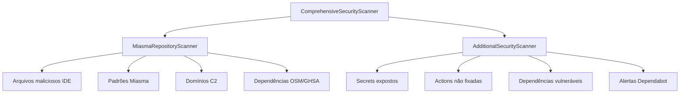

# Auditoria de Segurança

O motor **Miasma** executa varreduras abrangentes nos repositórios GitHub conectados, detectando vulnerabilidades em múltiplas categorias.

---

## Como executar

### Via UI (recomendado)

1. Conecte conta GitHub ([GitHub OAuth](GitHub-OAuth))
2. Acesse **Auditorias** → **Nova auditoria**
3. Job executa em segundo plano — acompanhe pelo banner
4. Resultado disponível no dashboard e detalhe da auditoria

### Via API

```http
POST /v1/audit/jobs/audit-run
Authorization: Bearer <token>
```

Polling: `GET /v1/audit/jobs/:jobId` a cada 2,5s

### Via CLI

```bash
npm run audit:miasma -w BackEnd
```

---

## Categorias de detecção

| Categoria | Tipos de finding |
|-----------|------------------|
| **Malware Indicators** | `malicious_file`, `malicious_pattern`, `c2_domain` |
| **Secrets Exposure** | `exposed_secret` |
| **CI/CD Security** | `unpinned_action`, `compromised_action` |
| **Dependency Vulnerabilities** | `compromised_dependency`, `vulnerable_dependency`, `malware_advisory` |
| **Supply Chain** | `cloned_affected_repo`, `suspicious_config` |

---

## Scanner



Por repositório, o scanner analisa:

- Conteúdo de arquivos (padrões Miasma)
- Workflows GitHub Actions
- Manifestos de dependências (package.json, etc.)
- Alertas Dependabot abertos via GitHub API
- Cross-reference com threat intel cache

---

## Dependabot

Alertas GitHub Dependabot detectados na auditoria aparecem com tag **`[Dependabot]`** na UI e nos relatórios.

Requisito: `GITHUB_TOKEN` com escopo `security_events`.

---

## Relatórios

Cada auditoria gera:

| Artefato | Formato | Endpoint |
|----------|---------|----------|
| Relatório consolidado | JSON | `GET /v1/audit/reports/:id` |
| Markdown | `.md` | `GET /v1/audit/reports/:id/markdown` |
| PDF | `.pdf` | `GET /v1/audit/reports/:id/pdf` |
| Finding individual | `.md` / `.pdf` | Por findingId |

Persistência: `BackEnd/data/audits/{auditId}/`

---

## Veredito

O relatório inclui veredito consolidado baseado na severidade e quantidade de findings:

- Métricas: repositórios analisados, vulnerabilidades, pacotes monitorados
- Exibido no dashboard após conclusão

---

## Threat Intel pré-audit

Opcionalmente, sync de threat intel antes ou durante a auditoria enriquece detecções com:

- GitHub Advisory Database (GHSA)
- OpenSourceMalware (OSM)
- Baseline Miasma embutido

Veja [Threat Intelligence](Threat-Intelligence).

---

## Jobs vs síncrono

| Modo | Quando usar |
|------|-------------|
| **Job assíncrono** | UI, produção, muitos repos |
| **Síncrono** (`POST /audit/run`) | CLI, scripts, poucos repos |

Detalhes: [Jobs Assíncronos](Jobs-Assincronos)

---

## Próximos passos

- [Remediação](Remediacao) — corrigir findings
- [Interface](Interface) — telas de auditoria
- [Threat Intelligence](Threat-Intelligence) — sync de pacotes maliciosos
