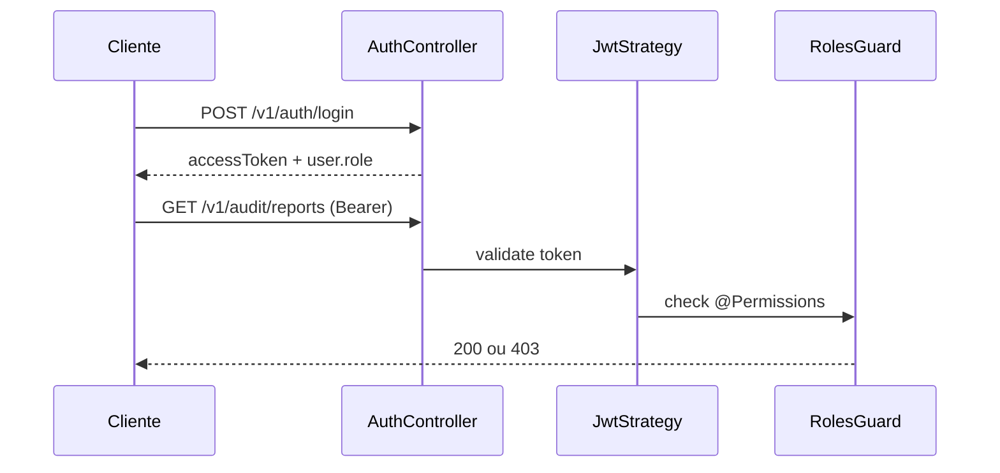
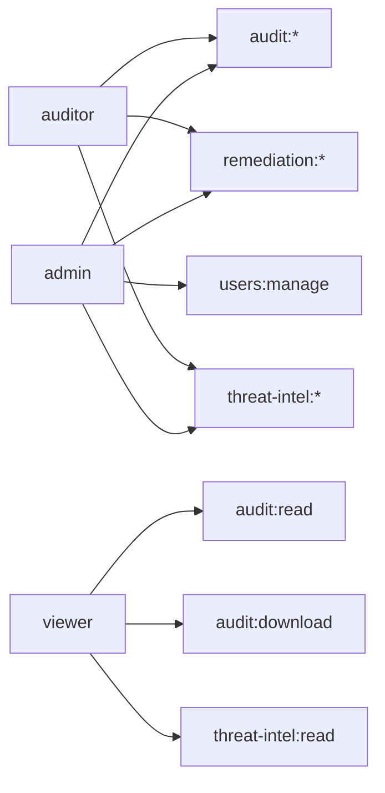

# Autenticação & RBAC

O App Audit usa **JWT** para autenticação e **RBAC** (Role-Based Access Control) para autorização granular.

---

## Fluxo de autenticação



Header em rotas protegidas:

```
Authorization: Bearer <accessToken>
```

---

## Papéis (roles)

| Papel | Descrição |
|-------|-----------|
| `admin` | Acesso total + gestão de usuários |
| `auditor` | Executar auditorias, remediação e threat intel |
| `viewer` | Somente leitura e download de relatórios |

---

## Matriz de permissões



| Permissão | admin | auditor | viewer |
|-----------|:-----:|:-------:|:------:|
| `audit:run` | ✅ | ✅ | ❌ |
| `audit:read` | ✅ | ✅ | ✅ |
| `audit:download` | ✅ | ✅ | ✅ |
| `remediation:preview` | ✅ | ✅ | ❌ |
| `remediation:apply` | ✅ | ✅ | ❌ |
| `threat-intel:read` | ✅ | ✅ | ✅ |
| `threat-intel:sync` | ✅ | ✅ | ❌ |
| `users:manage` | ✅ | ❌ | ❌ |

---

## Métodos de login

### E-mail e senha

`POST /v1/auth/login`

- Primeiro login exige aceite de Termo de Uso e Política de Privacidade
- Senhas hasheadas (bcrypt) em `data/users.json`

### GitHub OAuth

`GET /v1/auth/github` → consentimento LGPD → redirect → callback

Detalhes: [GitHub OAuth](GitHub-OAuth)

---

## Gestão de usuários

### Criar admin (primeiro boot)

```env
ADMIN_EMAIL=admin@empresa.com
ADMIN_PASSWORD=SenhaForte12+
```

### CLI

```bash
cd BackEnd
npm run users:create -- \
  --email user@empresa.com \
  --password "SenhaForte12+" \
  --name "Nome" \
  --role auditor
```

### Admin UI

Rota `/dashboard/admin` — visível apenas para `admin`:

- Criar usuários
- Editar nome, papel e senha
- Listar usuários existentes

### API

`POST /v1/auth/users` · `GET /v1/auth/users` (admin only)

---

## Implementação técnica

| Camada | Componente |
|--------|------------|
| Backend | `@Permissions('audit:run')` + `RolesGuard` |
| Constantes | `domain/constants/rbac.constants.ts` |
| Frontend | `useAuthStore().can('audit:run')` |
| Token | Persistido em localStorage via Zustand |

---

## Segurança

| Medida | Detalhe |
|--------|---------|
| JWT expiração | Padrão 8h (`JWT_EXPIRES_IN`) |
| Secret | Mínimo 32 chars em produção |
| Swagger | Desabilitar em prod (`SWAGGER_ENABLED=false`) |
| CORS | URL exata do frontend, sem `*` |

---

## Próximos passos

- [LGPD & Privacidade](LGPD) — consentimentos
- [Referência da API](API) — endpoints de auth
- [Interface](Interface) — tela de administração
