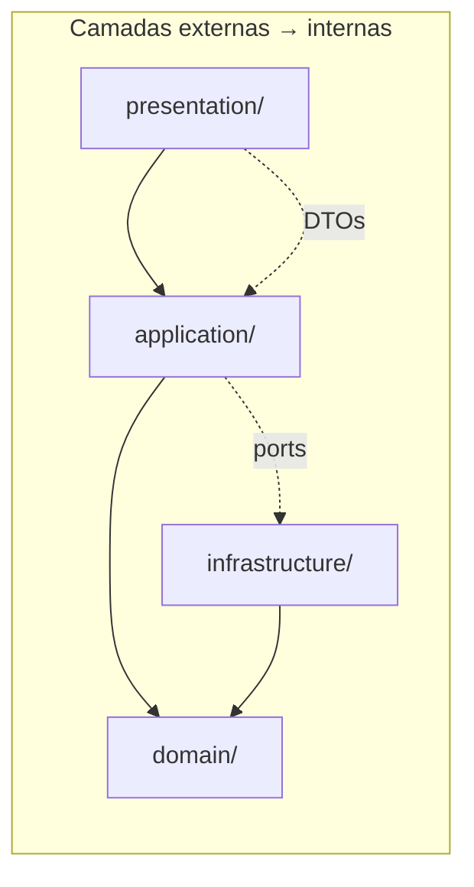
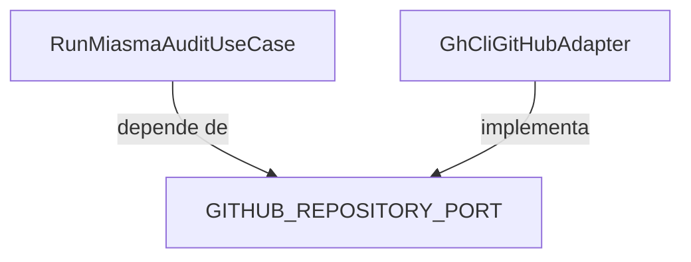

# Clean Architecture

O BackEnd do App Audit segue **Clean Architecture** com separação clara de responsabilidades e dependências unidirecionais.

---

## Diagrama de camadas



**Regra de ouro:** `domain/` não depende de nenhuma camada externa.

---

## Responsabilidades

### domain/

Entidades, value objects, ports (interfaces) e constantes puras.

```
domain/
├── entities/          # AuditReport, ThreatFinding, User
├── ports/             # GITHUB_REPOSITORY_PORT, REMEDIATION_PORT
└── constants/         # rbac.constants.ts
```

- Sem imports de NestJS, fs, axios ou gh
- Testável sem infraestrutura

### application/

Use cases que orquestram a lógica de negócio.

```
application/
├── audit/
│   ├── run-miasma-audit.use-case.ts
│   └── remediation.use-case.ts
├── auth/
│   └── auth.service.ts
└── threat-intel/
    └── sync-threat-intelligence.use-case.ts
```

- Recebe ports via injeção de dependência
- Não conhece HTTP nem filesystem diretamente

### infrastructure/

Implementações concretas dos ports.

```
infrastructure/
├── github/            # GhCliGitHubAdapter
├── scanners/          # ComprehensiveSecurityScanner
├── storage/           # AuditReportStore, BackgroundJobStore
├── remediation/       # RemediationGitWorkspace
└── pdf/               # PdfReportGenerator
```

### presentation/

Controllers HTTP, DTOs, guards e decorators.

```
presentation/
├── audit.controller.ts
├── auth.controller.ts
├── threat-intel.controller.ts
└── dto/
```

---

## Inversão de dependência



O use case declara **o que precisa** (port); a infraestrutura **fornece como** (adapter).

---

## Módulos NestJS

| Módulo | Camadas envolvidas |
|--------|-------------------|
| `AuthModule` | presentation + application + infrastructure |
| `AuditModule` | scanners, remediação, jobs, storage |
| `ThreatIntelModule` | sync GHSA/OSM, cache |

Providers registrados via tokens de injeção (`GITHUB_REPOSITORY_PORT`, etc.).

---

## Fluxo típico de uma requisição

```
HTTP Request
    → Controller (presentation)
    → Use Case (application)
    → Port → Adapter (infrastructure)
    → Entity (domain)
    ← DTO Response
```

---

## Benefícios no App Audit

| Benefício | Exemplo |
|-----------|---------|
| Testabilidade | Mock de `GhCliGitHubAdapter` nos testes |
| Substituibilidade | Trocar gh CLI por GitHub REST API |
| Clareza | Scanners isolados do HTTP |
| Evolução | v2 PostgreSQL sem alterar use cases |

---

## Próximos passos

- [Arquitetura](Arquitetura) — visão geral do sistema
- [Jobs Assíncronos](Jobs-Assincronos) — fila in-process
- [Desenvolvimento Local](Desenvolvimento-Local) — estrutura de pastas
