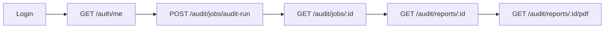

# Collections Postman & Insomnia

Collections prontas para testar a API do App Audit sem escrever requests manualmente.

---

## Postman

### Importar

1. Abra Postman → **Import**
2. Selecione o arquivo:
   ```
   docs/collections/postman/App-Audit.postman_collection.json
   ```
3. URL direta: [App-Audit.postman_collection.json](https://github.com/FranciscoStanley/app-audit/blob/master/docs/collections/postman/App-Audit.postman_collection.json)

### Usar

1. Execute **Auth → Login**
2. O token é salvo automaticamente em `accessToken`
3. Demais requests usam Bearer auth

---

## Insomnia

### Importar

1. **Application** → **Preferences** → **Data** → **Import Data**
2. Selecione:
   ```
   docs/collections/insomnia/App-Audit.insomnia_collection.json
   ```
3. URL direta: [App-Audit.insomnia_collection.json](https://github.com/FranciscoStanley/app-audit/blob/master/docs/collections/insomnia/App-Audit.insomnia_collection.json)

### Usar

1. Execute **Login**
2. Copie `accessToken` da resposta para o environment
3. Requests subsequentes usam o token

---

## Variáveis de ambiente

Configure no client:

| Variável | Valor (dev) |
|----------|-------------|
| `baseUrl` | `http://localhost:3000` |
| `accessToken` | *(preenchido após login)* |

---

## Fluxo recomendado de teste



1. **Login** — obter JWT
2. **Me** — validar token
3. **Job audit-run** — enfileirar auditoria
4. **Poll job** — aguardar conclusão
5. **Reports** — consultar resultado
6. **PDF** — download do relatório

---

## Endpoints cobertos

As collections incluem requests para:

- Auth (login, me, users, OAuth)
- Audit (jobs, reports, findings, markdown, pdf)
- Remediation (preview, apply, consent)
- Threat Intel (status, sync, packages)

---

## Sincronização

As collections são mantidas em sync com a API `/v1`. Ao alterar endpoints no código, atualize:

- `docs/collections/postman/`
- `docs/collections/insomnia/`
- `docs/api.md`

---

## Próximos passos

- [Referência da API](API) — contratos detalhados
- [Início Rápido](Inicio-Rapido) — subir a API local
- [Autenticação & RBAC](Autenticacao-RBAC) — papéis necessários
