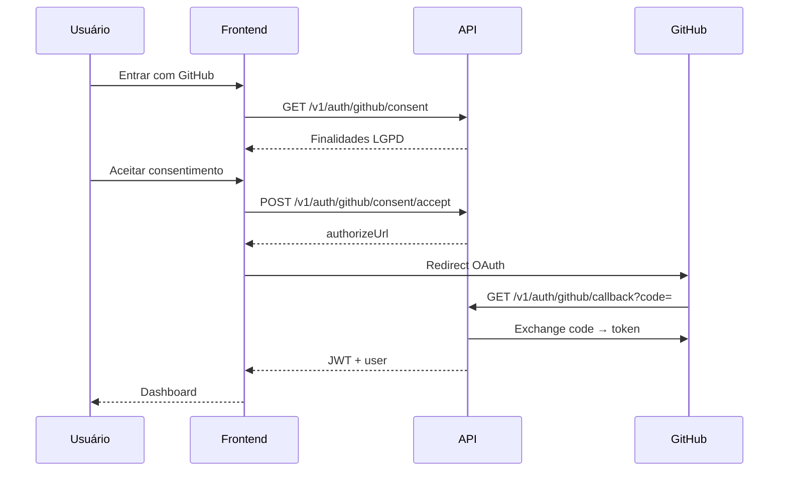

# GitHub OAuth

Configuração do **Login com GitHub** (OAuth 2.0) no App Audit.

---

## OAuth App registrado

| Campo | Valor (desenvolvimento) |
|-------|------------------------|
| Application name | `app-audit` |
| Homepage URL | `http://localhost:3001` |
| Authorization callback URL | `http://localhost:3000/v1/auth/github/callback` |
| Settings | [GitHub OAuth App](https://github.com/settings/applications/3659122) |

> O callback **deve** apontar para a **API** (`:3000`), não para o frontend.

---

## Variáveis de ambiente

```env
GITHUB_OAUTH_CLIENT_ID=<client_id>
GITHUB_OAUTH_CLIENT_SECRET=<client_secret>
GITHUB_OAUTH_CALLBACK_URL=http://localhost:3000/v1/auth/github/callback
FRONTEND_URL=http://localhost:3001
```

### Produção

```env
GITHUB_OAUTH_CALLBACK_URL=https://api.seudominio.com/v1/auth/github/callback
FRONTEND_URL=https://audit.seudominio.com
```

Atualize também o OAuth App no GitHub Developer Settings.

---

## Setup automatizado

```powershell
# PowerShell — defina credenciais na sessão (nunca commite)
$env:GITHUB_OAUTH_CLIENT_ID="<seu_client_id>"
$env:GITHUB_OAUTH_CLIENT_SECRET="<seu_client_secret>"
node scripts/setup-github-oauth.mjs
```

Reinicie o backend após configurar.

---

## Fluxo OAuth + LGPD



---

## Consentimento LGPD

Antes do redirect ao GitHub, a UI exibe modal com:

- Finalidades do tratamento de dados
- Escopos OAuth solicitados
- Terceiros envolvidos (GitHub)
- Direitos do titular (acesso, revogação, exclusão)

Registro em `data/consents.json` (`kind: github_oauth`).

---

## Revogar acesso

Na página **Auditorias**, o usuário pode:

- **Desconectar** conta GitHub
- **Revogar consentimento** OAuth

Tokens são removidos de `data/github-connections.json`.

---

## Admin automático

Usuários com e-mail ou username GitHub correspondente a `ADMIN_EMAIL` / `ADMIN_GITHUB_USERNAME` recebem papel `admin` automaticamente no primeiro login OAuth.

---

## Troubleshooting

| Problema | Solução |
|----------|---------|
| `redirect_uri mismatch` | Callback no GitHub = `GITHUB_OAUTH_CALLBACK_URL` |
| OAuth sem modal LGPD | Limpe cache; verifique versão ≥ 1.1.0 |
| Token inválido após login | Verifique `JWT_SECRET` consistente entre restarts |

---

## Próximos passos

- [LGPD & Privacidade](LGPD) — todos os fluxos de consentimento
- [Autenticação & RBAC](Autenticacao-RBAC) — papéis e permissões
