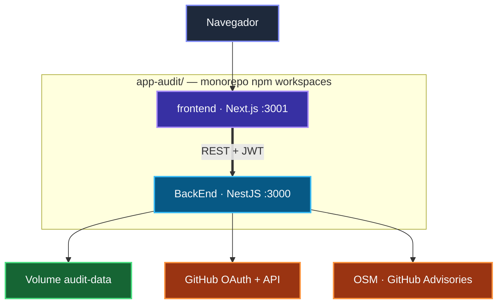

# App Audit

> Plataforma de auditoria de segurança para repositórios GitHub — detecção de malware (Miasma), supply chain, secrets, CI/CD, dependências comprometidas e **remediação automática**.

[](https://github.com/FranciscoStanley/app-audit/actions/workflows/ci.yml)
[](https://github.com/FranciscoStanley/app-audit/actions/workflows/security.yml)
[](https://github.com/FranciscoStanley/app-audit/blob/master/LICENSE)

---

## O que é o App Audit?

O **App Audit** é uma plataforma self-hosted que analisa repositórios GitHub em busca de vulnerabilidades de segurança e oferece correções automatizadas quando possível. Combina o motor **Miasma** (malware e supply chain), integração com **GitHub Advisories** e **OpenSourceMalware**, além de remediação via Dependabot, lockfiles e Pull Requests.

| Capacidade | Descrição |
|------------|-----------|
| 🔬 **Auditoria Miasma** | Varredura de malware, secrets, CI/CD e dependências |
| 🛠️ **Remediação** | Correções automáticas com PR quando a branch é protegida |
| 🌐 **Threat Intel** | Sync com GitHub Advisories e OpenSourceMalware |
| 🔐 **RBAC + JWT** | Papéis `admin`, `auditor` e `viewer` |
| 📋 **LGPD** | Consentimentos para login, OAuth e remediação |
| 📄 **Relatórios** | Markdown, PDF e findings individuais |

---

## Início em 3 minutos

```bash
git clone https://github.com/FranciscoStanley/app-audit.git
cd app-audit
cp .env.docker.example .env
# Edite JWT_SECRET, ADMIN_PASSWORD e GITHUB_TOKEN
docker compose up -d --build
```

| Serviço | URL |
|---------|-----|
| **Frontend** | http://localhost:3001 |
| **API** | http://localhost:3000 |
| **Health** | http://localhost:3000/health/ready |
| **Swagger** (dev) | http://localhost:3000/api/docs |

→ Detalhes completos: **[Início Rápido](Inicio-Rapido)**

---

## Arquitetura em resumo



→ Diagramas detalhados: **[Arquitetura](Arquitetura)**

---

## Navegação rápida

| Eu quero… | Ir para |
|-----------|---------|
| Subir a plataforma agora | [Início Rápido](Inicio-Rapido) |
| Entender a arquitetura | [Arquitetura](Arquitetura) |
| Configurar login com GitHub | [GitHub OAuth](GitHub-OAuth) |
| Consultar endpoints | [Referência da API](API) |
| Corrigir vulnerabilidades automaticamente | [Remediação](Remediacao) |
| Fazer deploy em produção | [Deploy em Produção](Deploy-Producao) |
| Contribuir com código | [Contribuindo](Contribuindo) |

---

## Stack tecnológica

| Camada | Tecnologia |
|--------|------------|
| API | NestJS 11 · Clean Architecture |
| Frontend | Next.js 16 · Tailwind CSS 4 · Zustand |
| Auth | JWT + Passport · RBAC |
| Integrações | GitHub CLI · GitHub Advisories · OpenSourceMalware |
| Deploy | Docker Compose · GHCR |

---

## Documentação no repositório

Esta wiki complementa a documentação em [`docs/`](https://github.com/FranciscoStanley/app-audit/tree/master/docs) do repositório principal. Para issues e código-fonte, use o [GitHub](https://github.com/FranciscoStanley/app-audit).

**Autor:** Francisco Stanley Rodrigues Albuquerque · **Versão:** 1.1.0 · **Licença:** [MIT](https://github.com/FranciscoStanley/app-audit/blob/master/LICENSE)
