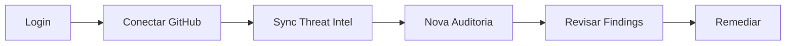

# Início Rápido

Este guia coloca o App Audit no ar em poucos minutos usando **Docker Compose** — a forma recomendada para avaliação e produção.

---

## Pré-requisitos

| Requisito | Versão mínima |
|-----------|---------------|
| Docker + Docker Compose | v2+ |
| Git | qualquer recente |
| Token GitHub | com escopos `repo` e `security_events` |

---

## Passo a passo

### 1. Clonar o repositório

```bash
git clone https://github.com/FranciscoStanley/app-audit.git
cd app-audit
```

### 2. Configurar variáveis de ambiente

```bash
cp .env.docker.example .env
```

Edite `.env` com valores seguros:

| Variável | Obrigatória | Descrição |
|----------|-------------|-----------|
| `JWT_SECRET` | ✅ | Mínimo 32 caracteres (`openssl rand -base64 48`) |
| `ADMIN_EMAIL` | ✅ | E-mail do primeiro administrador |
| `ADMIN_PASSWORD` | ✅ | Senha forte (12+ caracteres) |
| `GITHUB_TOKEN` | ✅ | Token PAT com `repo` + `security_events` |
| `GITHUB_OAUTH_CLIENT_ID` | Opcional | Login com GitHub |
| `GITHUB_OAUTH_CLIENT_SECRET` | Opcional | Login com GitHub |

### 3. Subir os containers

```bash
docker compose up -d --build
```

Atalhos npm equivalentes:

```bash
npm run docker:up      # build + start
npm run docker:stop    # parar
npm run docker:restart # rebuild após alterações
```

### 4. Acessar a aplicação

| Serviço | URL |
|---------|-----|
| **Frontend** | http://localhost:3001 |
| **API REST** | http://localhost:3000/v1/… |
| **Health (liveness)** | http://localhost:3000/health |
| **Health (readiness)** | http://localhost:3000/health/ready |

### 5. Primeiro login

1. Acesse http://localhost:3001
2. Faça login com `ADMIN_EMAIL` e `ADMIN_PASSWORD`
3. Aceite Termo de Uso e Política de Privacidade (primeiro acesso)
4. Conecte sua conta GitHub (opcional, mas necessário para auditorias)

---

## Verificar se está funcionando

```bash
# Health check
curl http://localhost:3000/health/ready

# Logs
docker compose logs -f backend frontend
```

Resposta esperada do readiness:

```json
{
  "status": "ok",
  "checks": {
    "storage": "ok",
    "jwt": "ok",
    "github": "ok",
    "threatIntel": "ok"
  },
  "version": "1.1.0"
}
```

---

## Fluxo típico após o setup



1. **Login** — e-mail/senha ou OAuth GitHub
2. **Conectar GitHub** — autorizar acesso aos repositórios
3. **Sync Threat Intel** — atualizar baseline de pacotes maliciosos
4. **Nova Auditoria** — varredura assíncrona em segundo plano
5. **Revisar Findings** — dashboard e página de vulnerabilidades
6. **Remediar** — correção individual ou em lote (com consentimento LGPD)

---

## Alternativa: desenvolvimento local

Sem Docker? Consulte [Desenvolvimento Local](Desenvolvimento-Local).

---

## Problemas comuns

| Sintoma | Solução |
|---------|---------|
| `401` no login | Verifique `ADMIN_EMAIL`/`ADMIN_PASSWORD` no `.env` |
| Auditoria falha | Confirme `GITHUB_TOKEN` válido e `gh` autenticado no container |
| CORS error | Ajuste `CORS_ORIGIN` para URL exata do frontend |
| OAuth não funciona | Veja [GitHub OAuth](GitHub-OAuth) |

---

## Próximos passos

- [Deploy em Produção](Deploy-Producao) — checklist de hardening
- [GitHub OAuth](GitHub-OAuth) — configurar login social
- [Auditoria](Auditoria) — entender o motor Miasma
