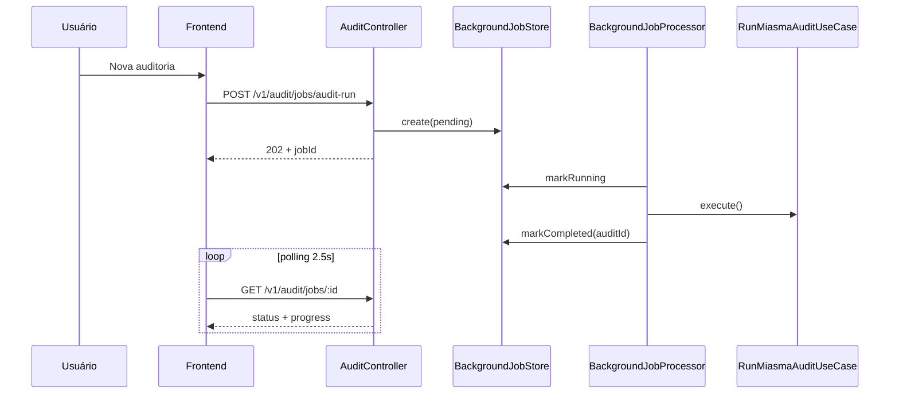

# Jobs Assíncronos

Varreduras e remediações executam como **jobs assíncronos** — a UI continua responsiva enquanto o trabalho pesado roda em segundo plano.

---

## Por que jobs assíncronos?

Repositórios grandes ou muitos repos podem:

- Exceder timeout de proxy (nginx, Cloudflare)
- Bloquear o worker Node por minutos
- Degradar a experiência do usuário

A solução v1.1+: enfileirar via API, processar in-process, poll status.

---

## Fluxo de auditoria



---

## Endpoints de jobs

| Método | Rota | Descrição |
|--------|------|-----------|
| POST | `/v1/audit/jobs/audit-run` | Enfileirar auditoria |
| POST | `/v1/audit/jobs/remediation` | Enfileirar remediação individual |
| POST | `/v1/audit/jobs/remediation-all` | Enfileirar remediação em lote |
| GET | `/v1/audit/jobs/:id` | Status do job |
| GET | `/v1/audit/jobs?status=running` | Jobs ativos |

Resposta inicial: **HTTP 202 Accepted** + `{ jobId }`.

---

## UI em segundo plano

O store `background-tasks-store` (Zustand + persist) centraliza:

| Tarefa | Sincronização |
|--------|---------------|
| Nova auditoria | Polling `GET /jobs/:id` a cada 2,5s |
| Remediação | Idem |
| Sync Threat Intel | HTTP síncrono + estado local |

Componentes:

- **Banner** (`BackgroundTasksBanner`) — topo do dashboard
- **Sidebar** — indicador de tarefas ativas
- **Reidratação** — jobs sobrevivem navegação e reload

---

## Persistência de jobs

```
BackEnd/data/jobs/{jobId}/job.json
```

Estados: `pending` → `running` → `completed` | `failed`

| Evento | Comportamento |
|--------|---------------|
| Reinício do backend | Jobs `running` → `failed` (não retomados) |
| Reload da página | Reassocia via `GET /jobs?status=running` |

---

## Endpoints síncronos (legado)

Mantidos para CLI e compatibilidade:

| Método | Rota |
|--------|------|
| POST | `/v1/audit/run` |
| POST | `/v1/audit/remediation/:id/apply` |
| POST | `/v1/audit/reports/:id/remediate-all` |

> Preferir jobs assíncronos na UI e integrações.

---

## Limitações v1

- **Single-node:** um processador in-process por instância
- **FIFO** em disco — sem priorização
- **v2 roadmap:** BullMQ + Redis para fila distribuída

Veja [Limitações v1](Limitacoes).

---

## Próximos passos

- [Auditoria](Auditoria) — motor Miasma
- [Remediação](Remediacao) — correções automatizadas
- [Interface](Interface) — banner e sidebar
