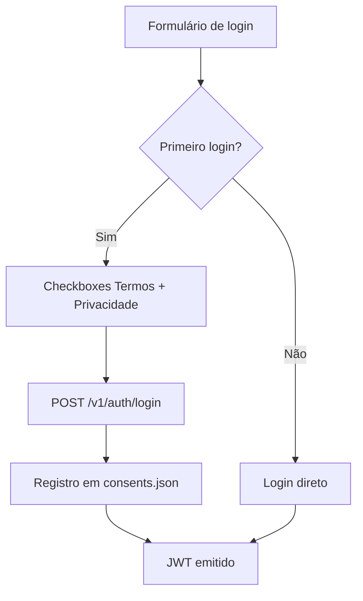

# LGPD & Privacidade

O App Audit implementa conformidade com a **LGPD** (Lei Geral de Proteção de Dados) através de três fluxos de consentimento explícito e documentação legal integrada.

---

## Versão da política

| Item | Valor |
|------|-------|
| Versão | **1.1.0** |
| Termo de Uso | `/termos` (público) |
| Política de Privacidade | `/privacidade` (público) |

---

## Três fluxos de consentimento

| Fluxo | `kind` | Quando |
|-------|--------|--------|
| Login e-mail | `email_login` | Primeiro login por e-mail/senha |
| OAuth GitHub | `github_oauth` | Antes do redirect ao GitHub |
| Remediação | `remediation` | Antes da primeira correção automática |

Registros persistidos em `data/consents.json` com:

- `userId`, `kind`, `policyVersion`
- `acceptedAt`, `ipAddress` (quando disponível)
- Metadados de finalidade e escopo

---

## Fluxo login e-mail



Verificação prévia: `GET /v1/auth/login/consent/required?email=`

---

## Fluxo OAuth GitHub

1. Usuário clica **Entrar com GitHub**
2. Modal exibe finalidades, escopos OAuth e direitos do titular
3. Aceite → `POST /v1/auth/github/consent/accept`
4. Redirect para GitHub OAuth
5. Callback → JWT + conexão GitHub cifrada

Revogação: página Auditorias → **Desconectar** / **Revogar consentimento**

---

## Fluxo remediação

Antes da primeira remediação (individual ou em lote):

1. Modal de consentimento específico
2. Descrição das ações autorizadas (push, PR, Dependabot)
3. Riscos e responsabilidades
4. Aceite → `POST /v1/audit/remediation/consent/accept`

Remediação bloqueada sem consentimento registrado.

---

## Dados tratados

| Dado | Finalidade | Base legal |
|------|------------|------------|
| E-mail, nome | Autenticação e RBAC | Execução de contrato |
| Token GitHub (cifrado) | Auditoria e remediação | Consentimento |
| Relatórios de auditoria | Segurança da organização | Legítimo interesse |
| Consentimentos | Prova de conformidade | Obrigação legal |

---

## Direitos do titular

A Política de Privacidade descreve:

- **Acesso** — solicitar cópia dos dados
- **Correção** — retificar dados incompletos
- **Eliminação** — solicitar exclusão
- **Revogação** — retirar consentimento OAuth/remediação
- **Portabilidade** — exportação quando aplicável

Contato configurável via:

```env
DATA_CONTROLLER_NAME=Sua Empresa
DATA_CONTROLLER_ADDRESS=Endereço completo
PRIVACY_CONTACT_EMAIL=privacidade@empresa.com
DPO_CONTACT_EMAIL=dpo@empresa.com
```

---

## Informações legais na API

| Endpoint | Descrição |
|----------|-----------|
| `GET /v1/auth/legal/info` | Versão, URLs, contatos (público) |
| `GET /v1/auth/login/consent` | Finalidades login e-mail |
| `GET /v1/auth/github/consent` | Finalidades OAuth |

---

## Responsabilidades do controlador

O App Audit fornece **mecanismos técnicos** de conformidade. A conformidade legal completa exige:

- Designação de encarregado (DPO) quando aplicável
- Políticas internas de retenção e exclusão
- Processo de resposta a solicitações de titulares
- DPIA quando o tratamento apresentar alto risco

---

## Próximos passos

- [GitHub OAuth](GitHub-OAuth) — configuração OAuth
- [Remediação](Remediacao) — ações automatizadas
- [Segurança](Seguranca) — reporte de vulnerabilidades
