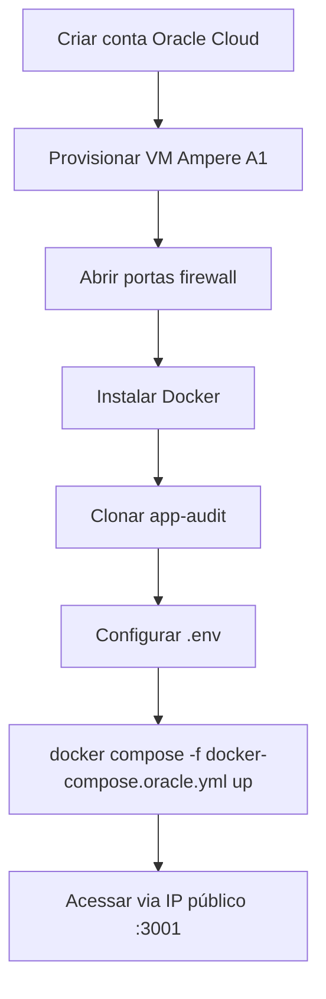

# Oracle Cloud (Always Free)

Deploy gratuito do App Audit em uma **VM Ampere A1** da Oracle Cloud usando Docker Compose.

---

## Visão geral

| Item | Detalhe |
|------|---------|
| Custo | **Always Free** (tier gratuito Oracle) |
| VM | Ampere A1 (ARM64) — 4 OCPU / 24 GB RAM |
| SO | Ubuntu 22.04+ |
| Stack | Docker Compose |

---

## Arquivos do projeto

| Arquivo | Função |
|---------|--------|
| `docker-compose.oracle.yml` | Compose adaptado para Oracle |
| `.env.oracle.example` | Variáveis de ambiente exemplo |
| `scripts/oracle-cloud/` | Scripts de provisionamento |
| `docs/deployment-oracle-cloud.md` | Guia passo a passo no repositório |

---

## Resumo do processo



---

## Passos principais

### 1. Criar VM

- Shape: **VM.Standard.A1.Flex**
- OCPU: 2–4 · Memory: 12–24 GB
- Imagem: Ubuntu 22.04
- Abrir portas: **22** (SSH), **3001** (frontend), **3000** (API, se exposta)

### 2. Instalar Docker

```bash
curl -fsSL https://get.docker.com | sh
sudo usermod -aG docker $USER
```

### 3. Clonar e configurar

```bash
git clone https://github.com/FranciscoStanley/app-audit.git
cd app-audit
cp .env.oracle.example .env
nano .env  # JWT_SECRET, ADMIN_PASSWORD, GITHUB_TOKEN
```

### 4. Subir a stack

```bash
docker compose -f docker-compose.oracle.yml up -d --build
```

### 5. Verificar

```bash
curl http://localhost:3000/health/ready
```

Acesse: `http://<IP-PUBLICO>:3001`

---

## Considerações ARM64

- Imagens Docker são multi-arch (amd64 + arm64)
- Build na VM Ampere é nativo — sem emulação
- Performance adequada para auditorias de dezenas de repositórios

---

## HTTPS (recomendado)

Para produção, configure:

1. Domínio apontando para IP da VM
2. Caddy ou nginx com Let's Encrypt
3. Atualizar `CORS_ORIGIN`, `FRONTEND_URL` e OAuth callback

---

## Guia completo

O passo a passo detalhado com screenshots e troubleshooting está em:

**[docs/deployment-oracle-cloud.md](https://github.com/FranciscoStanley/app-audit/blob/master/docs/deployment-oracle-cloud.md)**

---

## Próximos passos

- [Deploy em Produção](Deploy-Producao) — checklist de hardening
- [Operações](Operacoes) — backup do volume
- [GitHub OAuth](GitHub-OAuth) — login social
