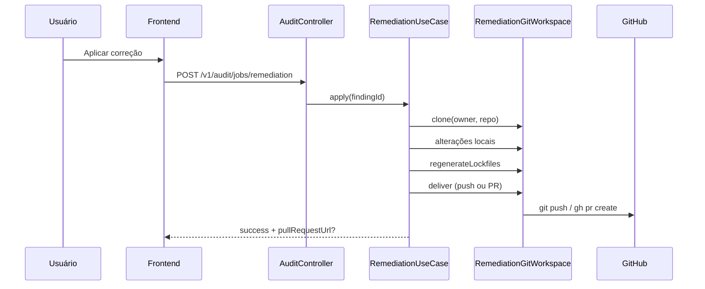

# Remediação Automática

O App Audit não apenas detecta vulnerabilidades — quando autorizado, **aplica correções automatizadas** nos repositórios GitHub.

---

## Capacidades

| Ação | Descrição |
|------|-----------|
| Atualizar manifestos | package.json, requirements.txt, etc. |
| Regenerar lockfiles | pnpm, npm, yarn, pip |
| Corrigir workflows | Fixar versões de GitHub Actions |
| Adicionar .gitignore | Padrões de secrets |
| Habilitar Dependabot | Via GitHub API |
| Criar Pull Request | Quando branch é protegida |
| Push direto | Quando branch permite |

---

## Fluxo de remediação



---

## Modos de uso

### Individual

1. Abra finding na página **Vulnerabilidades**
2. Expanda plano de remediação
3. Clique **Aplicar correção**
4. Job assíncrono — acompanhe pelo banner

### Em lote

1. Página **Vulnerabilidades**
2. Botão **Corrigir todas (N)**
3. Job assíncrono para todos os findings elegíveis

---

## Endpoints

| Método | Rota | Modo |
|--------|------|------|
| GET | `/v1/audit/remediation/:id/preview` | Preview do plano |
| POST | `/v1/audit/jobs/remediation` | Job individual |
| POST | `/v1/audit/jobs/remediation-all` | Job em lote |
| POST | `/v1/audit/remediation/:id/apply` | Síncrono (legado) |
| POST | `/v1/audit/reports/:id/remediate-all` | Síncrono lote |

---

## Git workspace

Pipeline de remediação:

```
clone (shallow)
  → alterações locais (manifest, .gitignore, workflows)
  → regenerateLockfiles (pnpm/npm/yarn/pip)
  → commit único
  → deliver (push ou PR)
```

Branch protegida → **Pull Request automático** com link retornado na UI.

---

## Consentimento LGPD

Obrigatório antes da **primeira** remediação:

- Modal descreve ações autorizadas e riscos
- Registro em `data/consents.json` (`kind: remediation`)
- Bloqueio técnico sem consentimento

Veja [LGPD](LGPD).

---

## Requisitos

| Item | Detalhe |
|------|---------|
| Token GitHub | Escopos `repo` + `security_events` |
| Ferramentas | `git`, `gh`, `pnpm`/`npm` no PATH |
| Docker | Inclusos na imagem `backend` |
| Revisão humana | PRs exigem review antes de merge |

---

## Dependabot

Para findings `[Dependabot]`:

1. Scanner lê alertas abertos via GitHub API
2. Remediação atualiza manifesto para versão segura
3. Regenera lockfile correspondente
4. Entrega via push ou PR

---

## Limitações

- Nem todo finding tem remediação automatizada
- Alterações complexas podem requerer intervenção manual
- Falhas de lockfile são reportadas no job status

---

## Próximos passos

- [Auditoria](Auditoria) — detectar vulnerabilidades
- [Jobs Assíncronos](Jobs-Assincronos) — fila e polling
- [Interface](Interface) — telas de remediação
